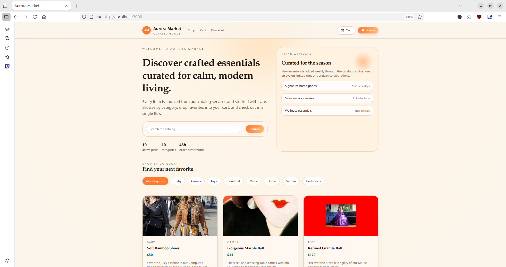
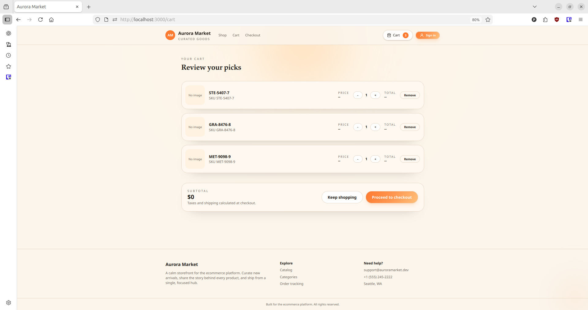
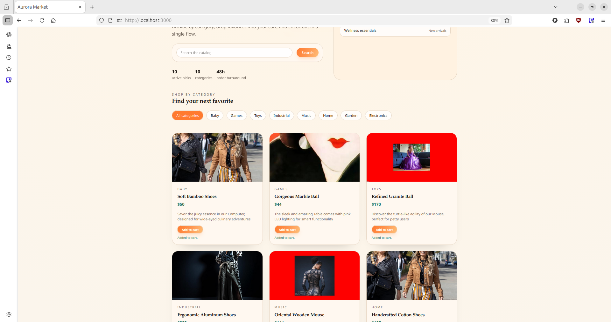
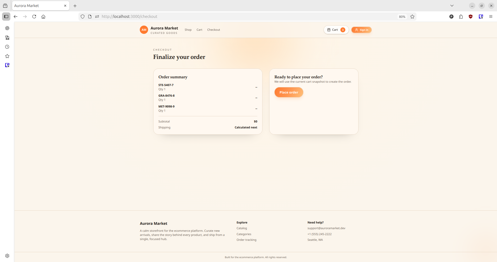
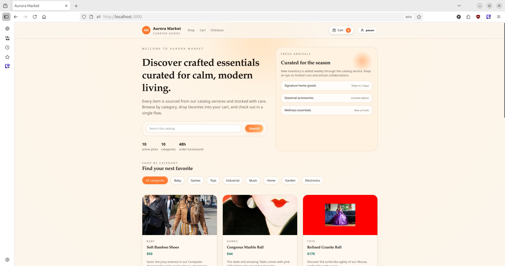
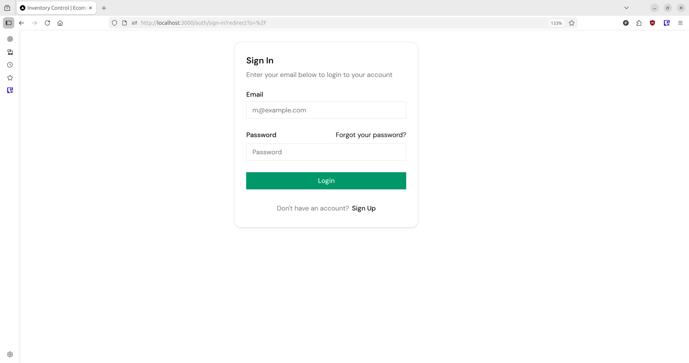
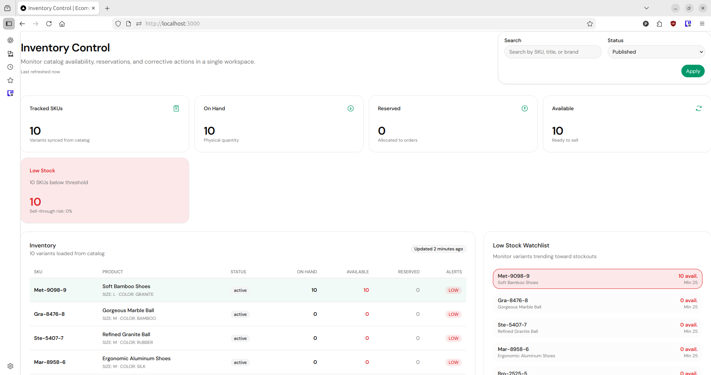
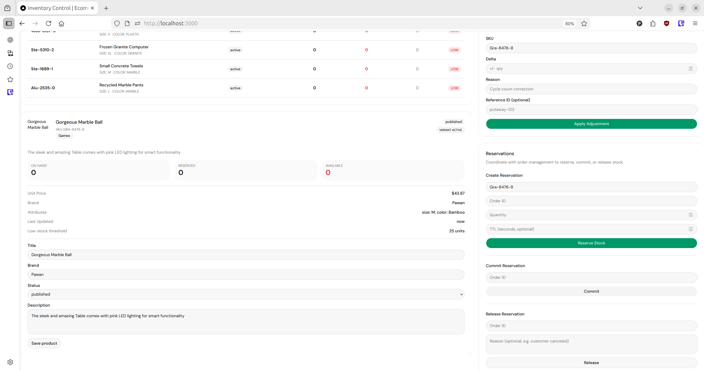
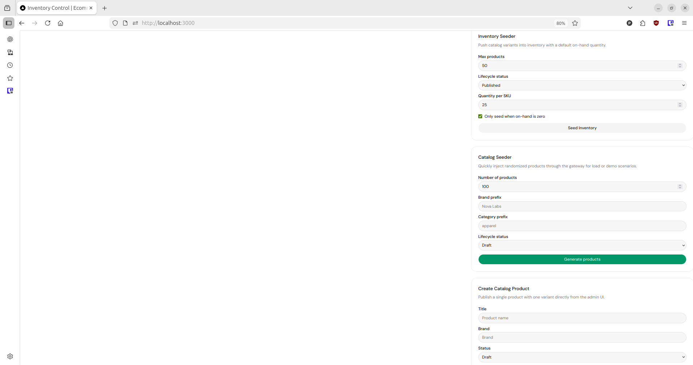

# Ecommerce Platform
End-to-end ecommerce workspace covering customer storefront, admin tooling, backend services, shared packages, and infra. The goal is simple: build a real, working platform where the apps and services evolve together and stay runnable at all times.

## Current Focus
- Keep `ecommerce-frontend` and `ecommerce-admin` moving in lockstep so shared contracts and auth stay consistent.
- Build against real data and infra (Neon/Upstash/RabbitMQ), not mock-only flows.
- Tighten service boundaries (catalog, cart, auth) so ownership and APIs stay clear.
- Track progress with concise docs and screenshots that reflect the current state.

## Project Gallery (Active Progress)
Include these screenshots as reference when updating UI, PRs, or documentation:

| Description | Preview |
| ------------ | ------- |
| `frontend-home-view.png` |  |
| `cart-section-view.png` |  |
| `add-to-cart-without-login-view.png` |  |
| `checkout-view.png` |  |
| `after-login-home-view.png` |  |
| `admin-signin.png` |  |
| `admin-dashboard-view.png` |  |
| `admin-dashboard-functionality-controls-view.png` |  |
| `admin-dashboard-functionality-2-view.png` |  |

## Architecture at a Glance
- **apps/**
  - `ecommerce-admin`: admin portal for catalog, orders, users, and ops.
  - `ecommerce-frontend`: customer storefront (browse, cart, checkout, account).
- **services/**: dedicated service implementations (catalog, cart, etc.) each with their own API contracts.
- **packages/**: shared UI, API clients, and utilities.
- **infra/**: infrastructure definitions and local support scripts.
- **scripts/**: build helpers, env bootstraps, and tooling.

## Feature Highlights
1. **Shared contracts** – services and apps use the same request/response shapes.
2. **Real infra** – product, cart, and session state live in active databases/Redis.
3. **Two-sided product** – admin and customer views stay in sync.
4. **Runnable at all times** – workspace builds cleanly with `pnpm install` + `pnpm build`.

## Running Locally
1. Copy the `.env` templates into the apps/services that require them and set the cloud-backed URLs (Neon DB, Upstash Redis, etc.) you depend on.
2. Run `pnpm install` at the repo root so every app/package gets its deps.
3. Start RabbitMQ or any other infra scripts from `scripts/` before `pnpm dev` if you need workers.
4. Build each app via `pnpm build` from the root (or inside a workspace app) so you know the compile step is clean.
5. Launch `pnpm dev` in `apps/ecommerce-frontend` and `apps/ecommerce-admin` as needed.

## Gallery (Active Progress)
Include these screenshots as reference when updating UI, PRs, or documentation:

| Description | Preview |
| ------------ | ------- |
| `frontend-home-view.png` |  |
| `cart-section-view.png` |  |
| `add-to-cart-without-login-view.png` |  |
| `checkout-view.png` |  |
| `after-login-home-view.png` |  |
| `admin-signin.png` |  |
| `admin-dashboard-view.png` |  |
| `admin-dashboard-functionality-controls-view.png` |  |
| `admin-dashboard-functionality-2-view.png` |  |

## Next Steps
- Keep app/service contracts aligned as new features land.
- Keep `pnpm install` and `pnpm build` green after dependency changes.
- Update screenshots and notes when the UI or flow changes.
